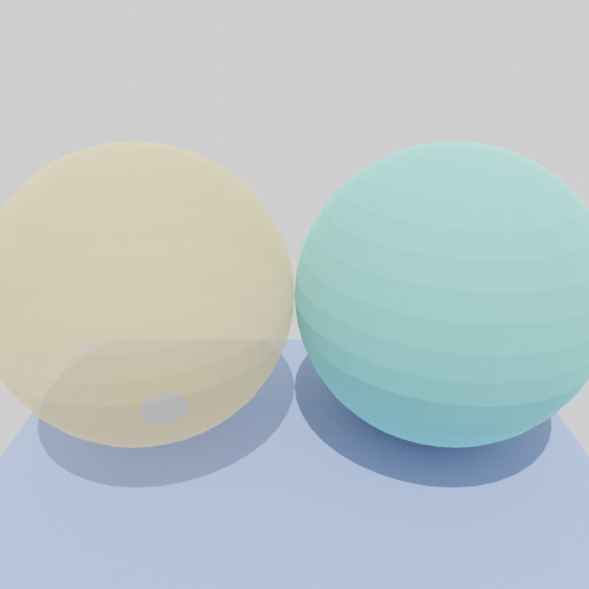

# Blender

## install

```bash
<path_to_blender>/2.93/python/bin/python3.9 -m ensurepip --upgrade
<path_to_blender>/2.93/python/bin/python3.9 setup.py develop
# For example, in my MacOS:
/Applications/Blender.app/Contents/Resources/2.82/python/bin/python3.7m -m ensurepip --upgrade
/Applications/Blender.app/Contents/Resources/2.82/python/bin/python3.7m setup.py develop
```

## render_example.py

In this example, we show how to render some simple primitives:

```bash
${blender} --background -noaudio --python examples/render_example.py -- xxx --out output/render_example.jpg --out_blend output/render_example.blend
```



## render grid

```bash
${blender} --background -noaudio --python examples/render_grid.py -- debug --out output/render_grid.jpg --out_blend output/render_grid.blend
```


## render multiple images

```bash
${blender} --background -noaudio --python examples/render_multiplane.py -- debug --out output/render_multiplane.jpg --out_blend output/render_multiplane.blend
```


## render skel